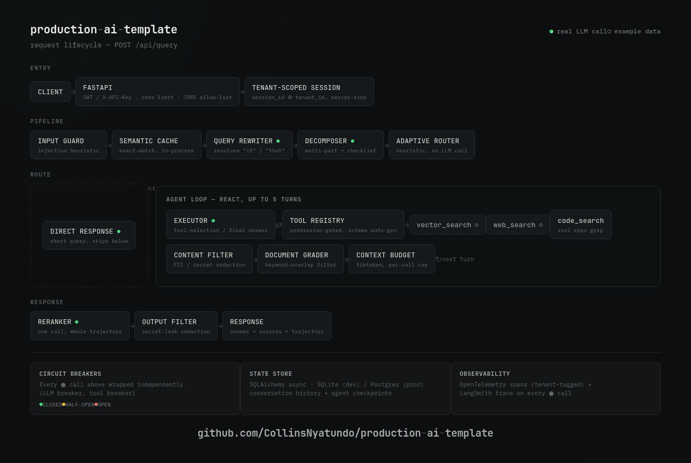

# production-ai-template

<p align="center">
  
</p>

<p align="center">
  <a href="https://github.com/CollinsNyatundo/production-ai-template/actions/workflows/ci.yml"></a>
  <a href="./LICENSE"></a>
  
  
</p>

A template for building AI agent backends where the infrastructure around the model is
actually real: LLM tool-calling with circuit-breaker resilience, an async state store,
strict typing enforced in CI (zero `Any` anywhere in the codebase - see `app/types.py`),
tenant-scoped sessions, and a test suite that mocks only at the LLM client boundary,
not throughout the application.

It's organized around a **9-layer architecture** and a six-component harness taxonomy,
$\mathcal{H} = (E, T, C, S, L, V)$ - execution loop, tools, context, state, lifecycle
hooks, and evaluation - which tracks recent (2025-2026) LLM-agent-engineering literature
proposing this kind of decomposition. That literature is young and not yet standardized
across sources, so treat the six-letter framing as one useful lens, not a settled
industry standard.

See **Status** below for the one honest gap: retrieval runs against example documents
until you point `hybrid_retriever.py` at a real vector database - everything else in
this list is live.

---

## Status: what's real vs. what's still example data

Everything below makes a real, live call to NVIDIA's OpenAI-compatible API
(`app/services/llm_client.py`) - agent tool-selection, final-answer generation, query
rewriting, query decomposition, and reranking. Circuit breakers wrap every one of these
calls and degrade to a clear fallback message (not fabricated content) if the LLM is
unreachable. LangSmith traces all of it when `LANGSMITH_TRACING_ENABLED=true`.

**Still example/placeholder, by design, given no external service was wired in for it:**
- `hybrid_retriever.py` returns a small fixed set of example documents about this
  repo's own architecture - there's no vector database behind it. Swap in Pinecone /
  Qdrant / pgvector / Chroma behind the same `retrieve()` interface to make this real.
- `web_search.py`'s web-search tool returns one canned result - it needs a real search
  API (Tavily, Brave, Serper, etc.) to be live. `code_search.py` does grep the real
  repository tree, so that one is real within its narrow scope.
- `semantic_cache.py` is an exact-string-match in-process cache, not embedding-based
  semantic similarity, and isn't Redis-backed yet despite `REDIS_URL` being configured.

If you're evaluating this template for your own use, the honest summary is: the
reasoning, resilience, auth, observability, and eval scaffolding are real and tested;
the retrieval corpus is a placeholder you need to point at real data.

---

## 🏗️ 9-Layer Architecture Overview

```
production-ai-template/
├── .claude/                  # Layer 9: AI Coding Agent Rules & Context
│   └── rules/                
│       ├── code-style.md     
│       └── testing.md        
├── .github/                  # CI/CD & DevSecOps
│   └── workflows/
│       └── ci.yml            # GitHub Actions (Lint, Type, Scan, Test, Eval)
├── app/                      
│   ├── __init__.py           
│   ├── components/           # Layer 2: Retrieval (Reranker; retriever is example data - see Status)
│   │   ├── hybrid_retriever.py
│   │   └── reranker.py       # Real: single batched LLM relevance-scoring call
│   ├── services/             # Layer 3: Core Orchestration (Pipelines, Caches, Memory)
│   │   ├── database.py       # Async SQLAlchemy Session Manager & Dialect Selector
│   │   ├── state_store.py    # Layer 4 (S): Persistent Database state store
│   │   ├── rag_pipeline.py   # Main pipeline orchestrator (guarded by breakers)
│   │   ├── llm_client.py     # NVIDIA NIM (OpenAI-compatible) client, LangSmith-traced
│   │   ├── semantic_cache.py # In-process exact-match cache (not Redis-backed yet)
│   │   ├── conversation.py   # Persistent conversation registry
│   │   ├── context_manager.py# Layer 4 (C): Context Token Budget Manager
│   │   ├── hooks.py          # Layer 5 (L): Lifecycle Hooks Event Registry
│   │   └── query_rewriter.py # Real: LLM-based rewrite using conversation history
│   ├── prompts/              # Layer 4 (C): Prompt Templates & Registry
│   │   ├── templates.py      
│   │   └── registry.py       # Local templates, with optional LangSmith Prompt Hub hot-swap
│   ├── agents/                # Layer 6 (E): Agentic Intelligence Layer
│   │   ├── executor.py       # (E) Real LLM-driven ReAct loop (tool-calling), guarded by breakers
│   │   ├── document_grader.py# Fast heuristic relevance filter (no LLM call, by design)
│   │   ├── query_decomposer.py # Real: LLM-based; multi-part queries become an explicit checklist fed to the agent
│   │   ├── adaptive_router.py# Skips the full agent loop for short/simple queries
│   │   └── tools/            # (T): Tool Registry & Definitions
│   │       ├── registry.py   # (T) Centralized validation & schema auto-generation
│   │       ├── vector_search.py
│   │       ├── web_search.py
│   │       └── code_search.py
│   ├── security/             # Layer 7: Guardrails & Gatekeepers
│   │   ├── auth.py           # Authentication dependency (JWT Bearer & X-API-Key)
│   │   ├── resilience.py     # Asynchronous Circuit Breakers (LLM & Tools)
│   │   ├── input_guard.py    # Regex heuristic prompt-injection first-pass filter
│   │   ├── content_filter.py # Regex-based PII/secret redaction on retrieved docs
│   │   └── output_filter.py  # Regex-based secret-leak redaction on LLM output
│   ├── main.py               # Layer 1: Core API Entrypoint (FastAPI + Throttling)
│   ├── config.py             # Refuses to boot outside dev with the default JWT secret
│   ├── models.py             
│   ├── types.py              # Shared TypedDicts/type aliases (see Continuous Integration below for the zero-Any enforcement)
│   └── Dockerfile            
├── migrations/               # Database Schema Migrations (Alembic)
│   ├── env.py                # Asynchronous migration runner
│   └── versions/             # Version history folder
├── alembic.ini                
├── evaluation/                # Layer 8: Evaluation Framework
│   ├── golden_dataset.json   
│   ├── offline_eval.py       # Active and post-hoc JSONL trajectory evaluation runner
│   └── trajectory_logger.py  # Layer 8 (V): Canonical JSONL trace exporter
├── observability/             # Layer 8: Observability Stack
│   ├── prometheus_rules.yml  # Prometheus Alerts & SLO rules
│   ├── tracer.py              # OpenTelemetry context-propagated tracer (spans/tenant context)
│   ├── feedback.py            # Links user scores to spans
│   └── cost_tracker.py        # Tracks prompt/completion token pricing from real usage
├── data/                       # Ingestion configs (Raw files are git-ignored)
├── scripts/                    # Programmatic migrations CLI, seeding, healthchecks
│   └── migrate.py              
├── frontend/                   # Separately containerized Streamlit client
└── tests/                      # Unit/integration tests; LLM calls mocked at the client boundary
```

---

## 🔬 Agent Harness Architecture: $\mathcal{H} = (E, T, C, S, L, V)$

### 1. E (Execution Loop)
* **File:** [executor.py](app/agents/executor.py)
* **Purpose:** ReAct-style agent loop: the LLM sees the available tools' schemas each
  turn and decides whether to call one or answer directly. The last allowed turn forces
  `tool_choice="none"` so the loop always terminates with an actual answer.
* **Resilience:** LLM calls are wrapped in an `AsyncCircuitBreaker`; tool calls in a
  separate one, so a failing tool doesn't take down the agent's ability to reason with
  what it already has.
* **State Management:** Enforces a configurable `max_turns` limit (default: 5) and
  deletes temporary checkpoints from the database store upon successful loop termination.

### 2. T (Tool Registry)
* **File:** [registry.py](app/agents/tools/registry.py)
* **Purpose:** Centralized tools registrar.
* **Security Gating:** Automatically generates JSON parameter schemas using Python signature introspection. Enforces permission scopes (e.g., `code_search` requires `high` permission, whereas `vector_search` requires `low`). Permission levels are checked server-side, mapped from decrypted JWT or API Key tokens - never trusted from client input.

### 3. C (Context Manager)
* **File:** [context_manager.py](app/services/context_manager.py)
* **Purpose:** Manages the LLM's context window.
* **Mitigations:** Counts tokens via `tiktoken`, budgets and truncates the
  lowest-scoring documents to fit. Because the wired-in model is NVIDIA-hosted Llama,
  not an OpenAI model, tiktoken has no exact tokenizer for it - counting is a
  deliberately conservative proxy, documented in code, not presented as exact for the
  configured model. Falls back to a character-based estimate if tiktoken's encoding
  files can't be loaded at all (e.g. restricted network egress with no pre-warmed
  cache); see `app/Dockerfile` for the build-time fix that avoids this in normal
  container deployments.

### 4. S (State Store)
* **File:** [state_store.py](app/services/state_store.py)
* **Purpose:** Database-backed state management.
* **Database Engine:** Uses an asynchronous SQLAlchemy connection pool. Dynamically select dialects: PostgreSQL (via `postgresql+asyncpg`) or SQLite fallback (via `sqlite+aiosqlite` for zero-config local developer runs).
* **Migrations & Rollbacks:** Fully configured with Alembic migrations. Programmatic deployments can be run from the CLI:
  * **Upgrade:** `python scripts/migrate.py upgrade`
  * **Rollback:** `python scripts/migrate.py downgrade`

### 5. L (Lifecycle Hooks)
* **File:** [hooks.py](app/services/hooks.py)
* **Purpose:** Decouples core logic from audit utilities. Pub/sub event emitter notifying subscribers of events like `on_agent_start`, `on_tool_execute`, `on_llm_call`, and `on_error` concurrently.

### 6. V (Valuation Interface)
* **File:** [offline_eval.py](evaluation/offline_eval.py)
* **Purpose:** Continuous quality evaluation via concept recall: each golden-dataset
  case lists key concepts a good answer should contain, and the runner checks the
  live LLM's actual answer against them. This is a real, meaningful check once the
  answer is genuinely LLM-generated (it is, as of this version) - it's still a simple
  keyword-recall method, not full semantic correctness grading, so treat it as a
  regression smoke test, not a substitute for human eval.
* **Active Eval:** Runs query datasets against the live system, calculates concept recall metrics, and audits the agent's tool selection trajectory.
* **Historical Post-Hoc Eval:** Parses recorded production runs from `evaluation/eval_results/trajectory_runs.jsonl` post-hoc to evaluate answer drift over time. Exits with status code `1` if quality scores degrade.

---

## 🛡️ Production Hardening

### 🔐 Authentication & Authorization
* **Layer:** [auth.py](app/security/auth.py)
* **Design:** Supports JWT bearer tokens and `X-API-Key` headers against example/demo
  credential stores (`DEMO_API_KEYS`/`DEMO_USERS` - replace with a real user store
  before using this outside local development). Rejects requests with invalid tokens.
* **Dev convenience, guarded:** Unauthenticated requests get a full-admin identity when
  `APP_ENV=development` (the default). `app/config.py` refuses to start in any other
  `APP_ENV` unless `JWT_SECRET` has been changed from the published default, so this
  convenience path can't silently ship active in a real deployment.
* **Tool Authorization:** Overrides client-provided permissions JSON payload properties with verified server-side JWT roles to secure high-risk actions.
* **Session isolation:** `session_id` is prefixed server-side with the authenticated
  caller's `tenant_id` (see `_scoped_session_id` in `app/main.py`) before it touches
  conversation history or agent checkpoints - two tenants can't collide on the same
  client-chosen session name, and a caller can't read or clear a session outside their
  own tenant by guessing the id.

### ⚡ Resilience Circuit Breakers
* **Layer:** [resilience.py](app/security/resilience.py)
* **Design:** Asynchronous `AsyncCircuitBreaker`, with state transitions guarded by a
  lock so a HALF-OPEN recovery probe only lets one call through at a time instead of a
  burst of concurrent callers all rushing the recovering service. Guards:
  * **LLM calls** (reasoning, generation, rewriting, decomposing, reranking): fall back
    to a clear "temporarily unavailable" message - never a fabricated answer.
  * **Tool calls:** a failing tool doesn't abort the agent turn; the failure becomes
    the tool's observation and the LLM decides what to do next.

### 📊 Observability
* **Request/tenant tracing:** [tracer.py](observability/tracer.py) - OpenTelemetry wrapper enriched with `contextvars` to automatically propagate `tenant.id` and `user.id` down async execution threads without changing function signatures.
* **LLM call tracing:** `app/services/llm_client.py` wraps the NVIDIA client with LangSmith's `wrap_openai`, when `LANGSMITH_TRACING_ENABLED=true` and an API key is set - full message/tool-call/token detail per call, at https://smith.langchain.com. Off by default so the template runs with zero LangSmith setup.
* **SLOs & Alerts:** Configured in [prometheus_rules.yml](observability/prometheus_rules.yml) monitoring latency (P95 latency > 3s), error rates (5xx errors > 2%), and circuit-breaker tripping.

### 🧪 Continuous Integration (CI/CD)
* **Layer:** [.github/workflows/ci.yml](.github/workflows/ci.yml)
* **Design:** On push/pull request, spins up containerized runner executing:
  * Style enforcement and linter + formatter checks (`ruff check`, `ruff format --check`)
  * Static type validation (`mypy`) across `app`, `evaluation`, `observability`,
    `scripts`, and `tests` - `disallow_any_generics` + `warn_return_any` enforced, so
    `Any` (explicit or leaked from an untyped call) fails the build. See `app/types.py`
    for the shared types this makes possible instead of `Dict[str, Any]` everywhere.
  * Security vulnerability scanning (`bandit`)
  * Unit test suite execution (`pytest`) - LLM calls mocked at the `llm_client` boundary, not hardcoded into runtime modules; see `tests/test_llm_integration.py`
  * Database migrations, then quality evaluations (`offline_eval.py`) - the eval step
    needs a real `NVIDIA_API_KEY` configured as a repo secret to pass; without one it
    correctly reports 0% concept recall rather than silently skipping

---

## 🚀 Getting Started

### Local Development Setup
1. Clone this repository.
2. Initialize virtual environment and dependencies:
   ```bash
   poetry install
   ```
3. Set up environment variables:
   ```bash
   cp .env.example .env
   ```
   At minimum, set `NVIDIA_API_KEY` (get one at [build.nvidia.com](https://build.nvidia.com))
   for the agent/generation calls to work rather than falling back to the
   "unavailable" message. `LANGSMITH_API_KEY` is optional (tracing).
4. Perform database schema migration setup:
   ```bash
   python scripts/migrate.py upgrade
   ```
5. Start the backend API, Streamlit client, and Redis Cache:
   ```bash
   docker-compose up --build
   ```
   The Streamlit UI authenticates automatically with a demo key by default (see
   `FRONTEND_API_KEY` in `docker-compose.yml`) - the sidebar shows whether it's
   sending real credentials or falling back to the backend's dev-mode bypass.

### Running Tests
```bash
python -m pytest
```

### Running Evaluations
```bash
# Run fresh active queries check
python evaluation/offline_eval.py

# Scan recorded history logs
python evaluation/offline_eval.py --historical
```

### API Usage Example
```bash
curl -X POST "http://localhost:8000/api/query" \
     -H "Content-Type: application/json" \
     -H "X-API-Key: api-key-admin-12345" \
     -d '{
       "query": "What is semantic caching?",
       "session_id": "session-101",
       "use_cache": true
     }'
```
`api-key-admin-12345` is the published example key in `DEMO_API_KEYS`
(`app/security/auth.py`) - treat it as public/compromised by definition and replace it
with a real credential store before deploying anywhere reachable by anyone else.
