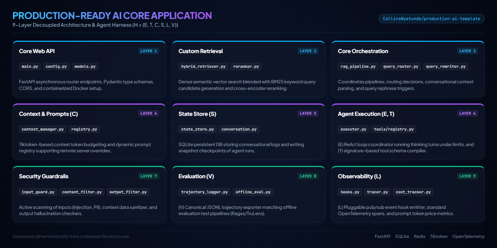

# Production-Ready AI Application Template

<p align="center">
  
</p>

This repository represents a robust, enterprise-grade template for building scalable, secure, and observable AI/LLM-based applications. It is based on a modern **9-layer AI application architecture** and integrates the formal **Agent Harness** framework:

$$\mathcal{H} = (E, T, C, S, L, V)$$

It addresses and resolves the critical architectural pitfalls of typical prototypes (e.g., Git database bloat, volatile memory loss, hardcoded prompts, and token window crashes) by hardening each layer with production-grade database structures, authentication gating, resilience circuit breakers, multi-tenant tracing, continuous evaluation, and CI/CD automation.

---

## 🏗️ 9-Layer Architecture Overview

The codebase is organized into modular layers that cleanly isolate concerns:

```
production-ai-template/
├── .claude/                  # Layer 9: AI Coding Agent Rules & Context
│   └── rules/                
│       ├── code-style.md     
│       └── testing.md        
├── .github/                  # CI/CD & DevSecOps
│   └── workflows/
│       └── ci.yml            # GitHub Actions (Lint, Type, Scan, Test, Eval)
├── app/                      
│   ├── __init__.py           
│   ├── components/           # Layer 2: Custom Retrieval (Hybrid search, Rerankers)
│   │   ├── hybrid_retriever.py
│   │   └── reranker.py
│   ├── services/             # Layer 3: Core Orchestration (Pipelines, Caches, Memory)
│   │   ├── database.py       # Async SQLAlchemy Session Manager & Dialect Selector
│   │   ├── state_store.py    # Layer 4 (S): Persistent Database state store
│   │   ├── rag_pipeline.py   # Main pipeline orchestrator (guarded by breakers)
│   │   ├── semantic_cache.py # Redis/memory semantic caching
│   │   ├── conversation.py   # Persistent conversation registry
│   │   ├── context_manager.py# Layer 4 (C): Context Token Budget Manager
│   │   ├── hooks.py          # Layer 5 (L): Lifecycle Hooks Event Registry
│   │   ├── query_rewriter.py 
│   │   └── query_router.py   
│   ├── prompts/              # Layer 4 (C): Prompt Templates & Registers
│   │   ├── templates.py      
│   │   └── registry.py       # Supports hot-swappable remote fetching
│   ├── agents/               # Layer 6 (E): Agentic Intelligence Layer
│   │   ├── executor.py       # (E) ReAct Agent Loop Coordinator (guarded by breakers)
│   │   ├── document_grader.py
│   │   ├── query_decomposer.py
│   │   ├── adaptive_router.py
│   │   └── tools/            # Layer 2 (T): Tool Registry & Definitions
│   │       ├── registry.py   # (T) Centralized validation & schemas registrar
│   │       ├── vector_search.py
│   │       ├── web_search.py
│   │       └── code_search.py
│   ├── security/             # Layer 7: Guardrails & Gatekeepers
│   │   ├── auth.py           # Authentication dependency (JWT Bearer & X-API-Key)
│   │   ├── resilience.py     # Asynchronous Circuit Breakers (LLM & Tools)
│   │   ├── input_guard.py    
│   │   ├── content_filter.py 
│   │   └── output_filter.py  
│   ├── main.py               # Layer 1: Core API Entrypoint (FastAPI + Throttling)
│   ├── config.py             
│   ├── models.py             
│   └── Dockerfile            
├── migrations/               # Database Schema Migrations (Alembic)
│   ├── env.py                # Asynchronous migration runner
│   └── versions/             # Version history folder
├── alembic.ini               
├── evaluation/               # Layer 8: Evaluation Framework
│   ├── golden_dataset.json   
│   ├── offline_eval.py       # Active and post-hoc JSONL trajectory evaluation runner
│   └── trajectory_logger.py  # Layer 8 (V): Canonical JSONL trace exporter
├── observability/            # Layer 8: Observability Stack
│   ├── prometheus_rules.yml  # Prometheus Alerts & SLO rules
│   ├── tracer.py             # OpenTelemetry context-propagated tracer
│   ├── feedback.py           # Links user scores to spans
│   └── cost_tracker.py       # Tracks prompt/completion token pricing
├── data/                     # Ingestion configs (Raw files are git-ignored)
├── scripts/                  # Programmatic migrations CLI, seeding, healthchecks
│   └── migrate.py            
├── frontend/                 # Separately containerized Streamlit client
└── tests/                    # CI-Ready unit & integration tests
```

---

## 🔬 Agent Harness Architecture: $\mathcal{H} = (E, T, C, S, L, V)$

This template fully implements the six harness components defined in state-of-the-art LLM engineering frameworks:

### 1. E (Execution Loop)
* **File:** [executor.py](file:///C:/Users/COLLINS/.gemini/antigravity/scratch/production-ai-template/app/agents/executor.py)
* **Purpose:** Implements a ReAct-style agent control loop that cycles through thinking, action execution, and observation checks.
* **Resilience:** Guarded by an `AsyncCircuitBreaker` wrapper protecting against downtime of downstream tool API resources. 
* **State Management:** Enforces a configurable `max_turns` limit (default: 5) and deletes temporary checkpoints from the database store upon successful loop termination.

### 2. T (Tool Registry)
* **File:** [registry.py](file:///C:/Users/COLLINS/.gemini/antigravity/scratch/production-ai-template/app/agents/tools/registry.py)
* **Purpose:** Centralized tools registrar.
* **Security Gating:** Automatically generates JSON parameter schemas using Python signature introspection. Enforces permission scopes (e.g., `code_search` requires `high` permission, whereas `vector_search` requires `low`). Permission levels are checked server-side, mapped from decrypted JWT or API Key tokens.

### 3. C (Context Manager)
* **File:** [context_manager.py](file:///C:/Users/COLLINS/.gemini/antigravity/scratch/production-ai-template/app/services/context_manager.py)
* **Purpose:** Manages the LLM's context window.
* **Mitigations:** Computes exact token lengths using `tiktoken` byte-pair encoding. When retrieved contexts exceed the model's budget (default: 1500 tokens), it dynamically prunes and truncates the lowest-scoring documents instead of overflowing the window.

### 4. S (State Store)
* **File:** [state_store.py](file:///C:/Users/COLLINS/.gemini/antigravity/scratch/production-ai-template/app/services/state_store.py)
* **Purpose:** Database-backed state management.
* **Database Engine:** Uses an asynchronous SQLAlchemy connection pool. Dynamically select dialects: PostgreSQL (via `postgresql+asyncpg`) or SQLite fallback (via `sqlite+aiosqlite` for zero-config local developer runs).
* **Migrations & Rollbacks:** Fully configured with Alembic migrations. Programmatic deployments can be run from the CLI:
  * **Upgrade:** `python scripts/migrate.py upgrade`
  * **Rollback:** `python scripts/migrate.py downgrade`

### 5. L (Lifecycle Hooks)
* **File:** [hooks.py](file:///C:/Users/COLLINS/.gemini/antigravity/scratch/production-ai-template/app/services/hooks.py)
* **Purpose:** Decouples core logic from audit utilities. Pub/sub event emitter notifying subscribers of events like `on_agent_start`, `on_tool_execute`, `on_llm_call`, and `on_error` concurrently.

### 6. V (Valuation Interface)
* **File:** [offline_eval.py](file:///C:/Users/COLLINS/.gemini/antigravity/scratch/production-ai-template/evaluation/offline_eval.py)
* **Purpose:** Continuous quality evaluation.
* **Active Eval:** Runs query datasets against the live system, calculates concept recall metrics, and audits the agent's tool selection trajectory.
* **Historical Post-Hoc Eval:** Parses recorded production runs from [trajectory_runs.jsonl](file:///C:/Users/COLLINS/.gemini/antigravity/scratch/production-ai-template/evaluation/eval_results/trajectory_runs.jsonl) post-hoc to evaluate answer drift and semantic precision over time. Exits with status code `1` if quality scores degrade.

---

## 🛡️ Production Hardening Gaps Bridged

### 🔐 Authentication & Authorization
* **Layer:** [auth.py](file:///C:/Users/COLLINS/.gemini/antigravity/scratch/production-ai-template/app/security/auth.py)
* **Design:** Supports JWT bearer tokens and `X-API-Key` headers. Rejects requests with invalid tokens and extracts the caller's identity and tenant context for trace routing.
* **Tool Authorization:** Overrides client-provided permissions JSON payload properties with verified server-side JWT roles to secure high-risk actions.

### ⚡ Resilience Circuit Breakers
* **Layer:** [resilience.py](file:///C:/Users/COLLINS/.gemini/antigravity/scratch/production-ai-template/app/security/resilience.py)
* **Design:** Asynchronous, non-blocking `AsyncCircuitBreaker` implementation guarding:
  * **LLM Query Router:** Falls back to default `vector_search` if LLM is down.
  * **LLM Query Rewriter:** Falls back to user's raw query if LLM is down.
  * **LLM Response Generator:** Serves cached baseline context if LLM is down.
  * **External Tools:** Avoids thread starvation by blocking downstream tool calls in half-open/open states.

### 📊 Observability & Prometheus Alerts
* **Layer:** [tracer.py](file:///C:/Users/COLLINS/.gemini/antigravity/scratch/production-ai-template/observability/tracer.py)
* **Design:** OpenTelemetry wrapper enriched with `contextvars` to automatically propagate `tenant.id` and `user.id` down async execution threads without changing function signatures.
* **SLOs & Alerts:** Configured in [prometheus_rules.yml](file:///C:/Users/COLLINS/.gemini/antigravity/scratch/production-ai-template/observability/prometheus_rules.yml) monitoring latency (P95 latency > 3s), error rates (5xx errors > 2%), and circuit-breaker tripping.

### 🧪 Continuous Integration (CI/CD)
* **Layer:** [.github/workflows/ci.yml](file:///C:/Users/COLLINS/.gemini/antigravity/scratch/production-ai-template/.github/workflows/ci.yml)
* **Design:** On push/pull request, spins up containerized runner executing:
  * Style enforcement and linter checks (`ruff`)
  * Static type validation (`mypy`)
  * Security vulnerability scanning (`bandit`)
  * Unit test suite execution (`pytest`)
  * Quality evaluations (`offline_eval.py`)

---

## 🚀 Getting Started

### Local Development Setup
1. Clone this repository.
2. Initialize virtual environment and dependencies:
   ```bash
   poetry install
   ```
3. Set up environment variables:
   ```bash
   cp .env.example .env
   ```
4. Perform database schema migration setup:
   ```bash
   python scripts/migrate.py upgrade
   ```
5. Start the backend API, Streamlit client, and Redis Cache:
   ```bash
   docker-compose up --build
   ```

### Running Tests
Execute the comprehensive test suite verifying the harness integration:
```bash
python -m pytest
```

### Running Evaluations
Execute live evaluations or scan historical logs:
```bash
# Run fresh active queries check
python evaluation/offline_eval.py

# Scan recorded history logs
python evaluation/offline_eval.py --historical
```

### API Usage Example
Access gated endpoints with API Keys or JWT tokens:
```bash
curl -X POST "http://localhost:8000/api/query" \
     -H "Content-Type: application/json" \
     -H "X-API-Key: api-key-admin-12345" \
     -d '{
       "query": "What is semantic caching?",
       "session_id": "session-101",
       "use_cache": true
     }'
```
