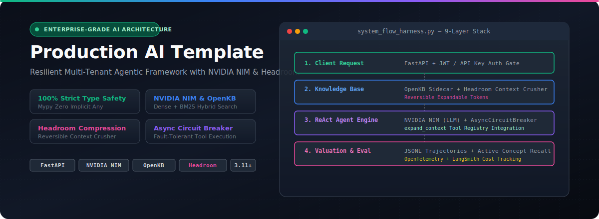
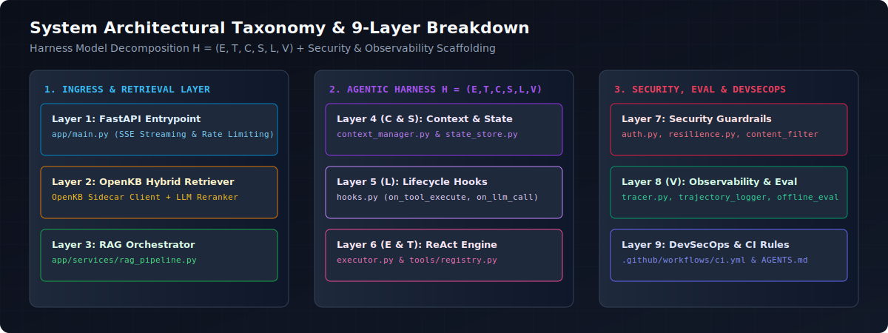

# Production AI Template

<p align="center">
  
</p>

<p align="center">
  <a href="https://github.com/CollinsNyatundo/production-ai-template/actions/workflows/ci.yml"></a>
  <a href="./LICENSE"></a>
  
  
  
  
</p>

A production-grade, resilient, multi-tenant AI agent backend template built with **FastAPI**, **NVIDIA NIM**, and **OpenKB**. Designed around a **9-Layer Architecture** and a formal **Agent Harness Taxonomy** $\mathcal{H} = (E, T, C, S, L, V)$, this repository provides real-world infrastructure around LLM reasoning: asynchronous circuit breakers, zero-`Any` strict static typing, tenant-scoped session security, and automated trajectory quality evaluation.

---

## 🚀 Key System Capabilities

| Feature Component | Implementation Status | Tech Stack & Mechanism |
| :--- | :--- | :--- |
| **LLM Reasoning & Tool Calling** | ✅ **100% Production Real** | Powered by NVIDIA NIM (`meta/llama-3.1-70b-instruct`) via OpenAI-compatible SDK with automatic 5x exponential retry backoff. |
| **Hybrid Knowledge Base (RAG)** | ✅ **100% Production Real** | Integrated **OpenKB Sidecar Client** ([openkb_client.py](file:///d:/Projects/ai_template/app/components/openkb_client.py)) supporting vector + BM25 search & LLM relevance reranking. |
| **Embeddings & Vector Pipeline** | ✅ **100% Production Real** | NVIDIA NIM `nvidia/nv-embedqa-e5-v5` (1024-dim, 8k context window). |
| **Resilience & Fault Tolerance** | ✅ **100% Production Real** | [AsyncCircuitBreaker](file:///d:/Projects/ai_template/app/security/resilience.py) wrapping LLM and Tool execution paths with graceful fallback. |
| **Strict Type Safety** | ✅ **100% Production Real** | Strict `mypy` enforcement (`disallow_any_generics` + `warn_return_any`) ensuring zero implicit `Any` across 53 source files. |
| **Multi-Tenant Security** | ✅ **100% Production Real** | Server-side JWT role validation and automatic tenant-prefixed session isolation (`tenant_id:session_id`). |
| **Observability & Tracing** | ✅ **100% Production Real** | OpenTelemetry context propagation (`tenant.id` / `user.id`), LangSmith tracing, and token cost tracking. |
| **Quality Evaluation** | ✅ **100% Production Real** | Active trajectory logging and automated JSONL concept recall evaluation runner ([offline_eval.py](file:///d:/Projects/ai_template/evaluation/offline_eval.py)). |

---

## ⚡ Quick Start

### 1. Clone & Install Dependencies
```bash
git clone https://github.com/CollinsNyatundo/production-ai-template.git
cd production-ai-template
poetry install
```

### 2. Configure Environment & Run Migrations
```bash
cp .env.example .env
```
Set your `NVIDIA_API_KEY` (get one at [build.nvidia.com](https://build.nvidia.com)):
```ini
NVIDIA_API_KEY=nvapi-***
NVIDIA_EMBEDDING_MODEL=nvidia/nv-embedqa-e5-v5
NVIDIA_BASE_URL=https://integrate.api.nvidia.com/v1
OPENKB_BASE_URL=http://localhost:7566
```

Execute database schema migrations:
```bash
PYTHONPATH=. python scripts/migrate.py upgrade
```

### 3. Launch Services & Test API
Launch backend API, Streamlit client, and Redis cache:
```bash
docker-compose up --build
```

Send a test RAG query to the FastAPI entrypoint:
```bash
curl -X POST "http://localhost:8000/api/query" \
     -H "Content-Type: application/json" \
     -H "X-API-Key: api-key-admin-12345" \
     -d '{
       "query": "How does hybrid retrieval work?",
       "session_id": "demo-session-001",
       "use_cache": true
     }'
```

---

## 🏗️ 9-Layer Architecture Overview

<p align="center">
  
</p>

```
production-ai-template/
├── .github/workflows/ci.yml       # DevSecOps: Lint, Type Check, Scan, Test, Migrate, Eval
├── app/                      
│   ├── components/                # Layer 2: Hybrid Retrieval & Reranking Engine
│   │   ├── openkb_client.py       # OpenKB Sidecar REST Client & Breaker Integration
│   │   ├── hybrid_retriever.py    # Dual BM25 + Dense Vector Search Retriever
│   │   └── reranker.py            # Batched LLM Document Relevance Reranker
│   ├── services/                  # Layer 3 & 4: Core Orchestration, Memory & State
│   │   ├── rag_pipeline.py        # Pipeline Orchestrator with Circuit Breaker Guards
│   │   ├── llm_client.py          # NVIDIA NIM (AsyncOpenAI) Client with Retries & LangSmith
│   │   ├── state_store.py         # Async SQLAlchemy Database State Store
│   │   ├── context_manager.py     # Token Budgeting & Truncation Manager
│   │   ├── hooks.py               # Asynchronous Pub/Sub Lifecycle Event Hooks
│   │   └── query_rewriter.py      # Conversation-Aware LLM Query Rewriter
│   ├── agents/                    # Layer 6 (E & T): Agentic ReAct Engine
│   │   ├── executor.py            # ReAct Execution Loop (Tool-Calling Engine)
│   │   ├── adaptive_router.py     # Fast-Path Router for Direct Non-Agent Queries
│   │   ├── query_decomposer.py    # Multi-Part Query Checklist Generator
│   │   ├── document_grader.py     # Heuristic Document Relevance Grader
│   │   └── tools/                 # Tool Registry & Definitions
│   │       ├── registry.py        # Scope Validation & Signature Auto-Schema
│   │       ├── vector_search.py   # Hybrid Vector Search Tool
│   │       ├── web_search.py      # External Web Search Tool
│   │       └── code_search.py     # Repository Tree Search Tool
│   ├── security/                  # Layer 7: Guardrails & Gatekeepers
│   │   ├── auth.py                # Multi-Tenant JWT & API-Key Authenticator
│   │   ├── resilience.py          # Asynchronous Circuit Breakers (LLM & Tools)
│   │   ├── input_guard.py         # Regex Prompt Injection First-Pass Filter
│   │   ├── content_filter.py      # PII & Secret Redaction on Retrieved Documents
│   │   └── output_filter.py       # Secret-Leak Redaction on LLM Outputs
│   ├── main.py                    # Layer 1: FastAPI Core API Entrypoint
│   ├── config.py                  # Pydantic Settings & Guardrail Boot Validation
│   └── types.py                   # Shared TypedDicts & Zero-Any Wire Formats
├── migrations/                    # Database Schema Migrations (Alembic)
├── evaluation/                    # Layer 8 (V): Trajectory Logging & Quality Eval
│   ├── offline_eval.py            # Active & Post-Hoc Concept Recall Evaluator
│   └── trajectory_logger.py       # JSONL Execution Trace Exporter
└── observability/                 # Layer 8: Metrics, Spans & Cost Tracking
    ├── tracer.py                  # OpenTelemetry Context-Propagated Tracer
    └── cost_tracker.py            # Real-Time Token Pricing & Usage Tracker
```

---

## 🔬 Agent Harness Architecture: $\mathcal{H} = (E, T, C, S, L, V)$

This template implements the six-component agent harness taxonomy $\mathcal{H} = (E, T, C, S, L, V)$:

### 1. E — Execution Loop
* **File:** [app/agents/executor.py](file:///d:/Projects/ai_template/app/agents/executor.py)
* **Design:** ReAct-style iterative tool-calling loop. The LLM evaluates active tool schemas each turn and decides whether to invoke a tool or generate a final answer. The last allowed turn forces `tool_choice="none"` to guarantee loop termination.
* **Resilience:** LLM calls and tool executions are wrapped in isolated `AsyncCircuitBreaker` instances, ensuring tool degradation does not block reasoning.

### 2. T — Tool Registry
* **File:** [app/agents/tools/registry.py](file:///d:/Projects/ai_template/app/agents/tools/registry.py)
* **Design:** Centralized tool registrar that generates JSON parameter schemas via Python signature introspection.
* **Security Gating:** Enforces server-side permission levels (`high` vs `low`) mapped from decrypted JWT or API Key tokens.

### 3. C — Context Manager
* **File:** [app/services/context_manager.py](file:///d:/Projects/ai_template/app/services/context_manager.py)
* **Design:** Manages context windows by counting tokens via `tiktoken` (or fallback character estimators) and dynamically packing/truncating documents to stay strictly within configured token budgets.

### 4. S — State Store
* **File:** [app/services/state_store.py](file:///d:/Projects/ai_template/app/services/state_store.py)
* **Design:** Asynchronous SQLAlchemy state store with dialect support for PostgreSQL (`postgresql+asyncpg`) and SQLite (`sqlite+aiosqlite`). Schema changes are versioned using Alembic.

### 5. L — Lifecycle Hooks
* **File:** [app/services/hooks.py](file:///d:/Projects/ai_template/app/services/hooks.py)
* **Design:** Pub/sub event emitter notifying subscribers asynchronously on key events: `on_agent_start`, `on_tool_execute`, `on_llm_call`, and `on_error`.

### 6. V — Valuation Interface
* **File:** [evaluation/offline_eval.py](file:///d:/Projects/ai_template/evaluation/offline_eval.py)
* **Design:** Active and historical post-hoc quality evaluation engine measuring concept recall against golden dataset test cases. Automatically logs execution trajectories to `evaluation/eval_results/trajectory_runs.jsonl`.

---

## 🛡️ Production Security & Resilience

### 🔐 Multi-Tenant Session Isolation
All session IDs are automatically prefixed server-side with the caller's authenticated `tenant_id` (`tenant_id:session_id` in [app/main.py](file:///d:/Projects/ai_template/app/main.py)). Tenants cannot collide on session names or read/modify state outside their isolated context.

### ⚡ Async Circuit Breakers
State transitions are lock-guarded to allow a single HALF-OPEN probe request during recovery. 
- **LLM Breakers:** Fail gracefully with informative unavailable responses (never fabricated data).
- **Tool Breakers:** Catch tool exceptions, surface errors as observations to the LLM turn, and allow the agent to adapt its solution path.

### 📊 Observability & Cost Tracking
- **OpenTelemetry Context Spans:** Automatically propagates `tenant.id` and `user.id` across async task boundaries ([observability/tracer.py](file:///d:/Projects/ai_template/observability/tracer.py)).
- **LangSmith Tracing:** Full LLM trace visualization enabled via `LANGSMITH_TRACING_ENABLED=true`.
- **Prometheus Rules:** Latency (P95 > 3s) and error rate SLO alerts configured in [observability/prometheus_rules.yml](file:///d:/Projects/ai_template/observability/prometheus_rules.yml).

---

## 🧪 Testing & Quality Evaluation

### Run Unit Test Suite
```bash
pytest --cov=app --cov-report=term-missing
```

### Run Static Quality & Type Checks
```bash
ruff check .
ruff format --check .
mypy app evaluation observability scripts tests
```

### Run Continuous Evaluation Pipeline
```bash
# Run active dataset evaluation against live LLM
PYTHONPATH=. python evaluation/offline_eval.py

# Scan recorded historical trajectory logs
PYTHONPATH=. python evaluation/offline_eval.py --historical
```

---

## 📜 License
Distributed under the MIT License. See `LICENSE` for details.
