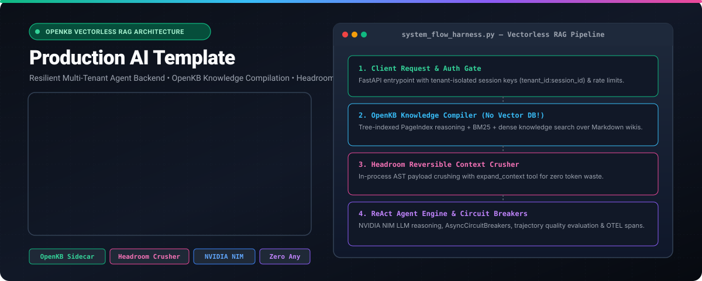
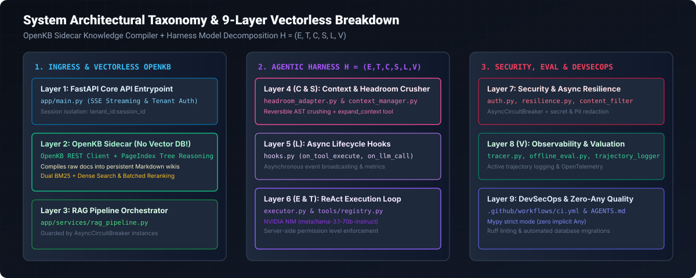

# Production AI Template

<p align="center">
  
</p>

<p align="center">
  <a href="https://github.com/CollinsNyatundo/production-ai-template/actions/workflows/ci.yml"></a>
  <a href="./LICENSE"></a>
  
  
  
  
  
  
</p>

Imagine asking a question in a clean, simple search interface and getting instant, accurate answers from your organization's entire collection of documents—without having to manage complex database clusters or search through hundreds of files.

Behind the simple interface, the system deploys intelligent AI helper agents that work inside a massive digital library of documents. These helpers automatically read, organize, and compile raw documentation into a persistent, interlinked knowledge wiki, instantly retrieving exact answers for users while abstracting away all backend complexity.

---

## 🤖 Intelligent Agent Suite Breakdown

This repository features a specialized suite of autonomous AI agents collaborating across the query lifecycle:

| Agent Component | Source Code File | Primary Role & Intelligence Mechanism |
| :--- | :--- | :--- |
| **Deep Research Orchestrator** | [app/services/deep_research/orchestrator.py](file:///d:/Projects/ai_template/app/services/deep_research/orchestrator.py) | **Multi-Agent Deep Research Engine**: Runs a 5-stage adversarial research pipeline combining Premise Red-Teaming, Genetic Crossover retrieval over OpenKB + Web Search, Plan Reflection, and Cross-Domain Stress Testing. |
| **ReAct Execution Engine** | [app/agents/executor.py](file:///d:/Projects/ai_template/app/agents/executor.py) | **Primary Reasoning Engine**: Iterative ReAct (Reason + Act) loop evaluating tool schemas, executing actions, observing sanitized results, and checkpointing state via SQLAlchemy (`state_store.py`). |
| **Adaptive Fast-Path Router** | [app/agents/adaptive_router.py](file:///d:/Projects/ai_template/app/agents/adaptive_router.py) | **Intent & Complexity Router**: Analyzes user input to route simple conversational prompts directly to `direct_response`, bypassing heavy agentic search for lower latency. |
| **Multi-Part Query Decomposer** | [app/agents/query_decomposer.py](file:///d:/Projects/ai_template/app/agents/query_decomposer.py) | **Sub-Question Generator**: Decomposes complex multi-faceted user prompts into a JSON array of targeted sub-questions for parallel research and complete coverage. |
| **Agentic Document Grader** | [app/agents/document_grader.py](file:///d:/Projects/ai_template/app/agents/document_grader.py) | **Relevance Pre-Filter**: Evaluates retrieved document chunks on every turn to filter out irrelevant or low-scoring matches before they reach the agent's context window. |
| **Tool Registry & Agents** | [app/agents/tools/registry.py](file:///d:/Projects/ai_template/app/agents/tools/registry.py) | **Scoped Tool Execution**: Dynamically validates actor permission levels (`high` vs `low`) and dispatches to OpenKB Vectorless Search (`vector_search.py`), Repository Code Search (`code_search.py`), Web Search (`web_search.py`), and Headroom Context Expansion (`expand_context`). |

---

## 🔬 Multi-Agent Deep Research Pipeline

When `search_mode="deep"` is specified, the query is dispatched to the **Deep Research Engine** ([app/services/deep_research/](file:///d:/Projects/ai_template/app/services/deep_research/)), which queries **BOTH internal OpenKB documentation AND external live web search** through an adversarial 5-agent pipeline:

```
                          ┌───────────────────────────┐
                          │  User Query (search_mode) │
                          └─────────────┬─────────────┘
                                        │
                         1. Premise Red-Teaming Agent
                                        │
                         2. Hierarchical Research Planner
                                        │
          ┌─────────────────────────────┴─────────────────────────────┐
          │     3. Candidates Crossover & Multi-Vector Retrieval Loop │
          │  ├── Technical Vector ───► OpenKB Documentation Wiki       │
          │  ├── Empirical Vector ──► Live Web Search Engine           │
          │  └── Counter-Evidence ──► Skeptical Auditor Verification  │
          └─────────────────────────────┬─────────────────────────────┘
                                        │
                         4. Cross-Domain Stress-Tester
                                        │
                         5. One-Shot Report Synthesizer
```

### Deep Research Pipeline Phases:
1. **Premise Red-Teaming ([premise_red_teamer.py](file:///d:/Projects/ai_template/app/services/deep_research/adversarial/premise_red_teamer.py))**: Attacks and stress-tests hidden assumptions in the initial user query before research begins.
2. **Hierarchical Task Graph Planning ([planner.py](file:///d:/Projects/ai_template/app/services/deep_research/planner.py))**: Constructs a structured, multi-turn research task graph in `GlobalResearchContext`.
3. **Candidates Crossover Engine ([crossover.py](file:///d:/Projects/ai_template/app/services/deep_research/crossover.py))**: Formulates 3 parallel search vectors across Technical, Empirical, and Counter-Evidence perspectives, retrieving from **OpenKB documentation, Web Search, and Code Search**, audited by `SemanticDocumentAuditor` and `SkepticalAuditor`.
4. **Plan Reflection & Early Stopping ([reflector.py](file:///d:/Projects/ai_template/app/services/deep_research/reflector.py))**: Evaluates research density and stops early when confidence thresholds are satisfied.
5. **Cross-Domain Stress-Testing & Synthesis ([synthesizer.py](file:///d:/Projects/ai_template/app/services/deep_research/synthesizer.py))**: Stress-tests facts against edge cases and generates a fact-dense research report.

---

## 🧠 Core Innovation: OpenKB Vectorless RAG

> [!IMPORTANT]
> **No Vector Database Required!**
> Traditional AI search systems rely heavily on complex vector databases (like Pinecone, Qdrant, or pgvector) that chop documents into arbitrary text fragments and lose critical context. This template uses **OpenKB** — an LLM-native knowledge compilation engine (VectifyAI / PageIndex architecture) that compiles raw documentation into persistent, interlinked Markdown wikis.

### 🌟 Top 5 Benefits of OpenKB over Vector DBs

1. ⚡ **Zero Vector DB Infrastructure Overhead:** Eliminates external vector database clusters (Pinecone, Qdrant, Milvus, pgvector), simplifying deployment, reducing monthly cloud bills, and eliminating index sync latency.
2. 🧠 **Compounding Knowledge Wiki vs. Fragmented Chunks:** Rather than slicing text into isolated chunk vectors that lose cross-document context, OpenKB continuously compiles unstructured documents into an interlinked Markdown wiki where knowledge compounds over time.
3. 🌳 **PageIndex Tree-Based Reasoning:** Navigates 100+ page PDFs, technical specs, and manuals using hierarchical tree indexing (`PageIndex`) — searching documents the way a human reads a table of contents rather than relying purely on keyword/vector distance.
4. 🔍 **Human-Readable & Obsidian-Compatible:** All knowledge outputs are stored as plain Markdown files (`.md`) complete with graph backlinks. Engineers can inspect, edit, or view the compiled knowledge base directly in PKM tools like Obsidian.
5. 🛡️ **Lossless Structural Context:** Preserves document hierarchy, section structures, and cross-references, eliminating chunk context loss and retrieval hallucinations.

### 📊 Architectural Comparison

| Feature Dimension | Traditional Vector DB RAG | OpenKB Knowledge Compilation (This Template) |
| :--- | :--- | :--- |
| **Database Requirement** | External Vector DB (Pinecone / pgvector) | **Zero Vector DB** (Plain Markdown Wikis) |
| **Retrieval Mechanism** | Vector similarity distance over chunks | **PageIndex Tree Indexing + BM25 + Dense Search** |
| **Knowledge Lifecycle** | Fixed, isolated vector chunks | **Compounding interlinked Markdown wiki** |
| **Auditability** | High-dimensional array floats (unreadable) | **Human-readable Markdown with Obsidian backlinks** |
| **Long Document Handling** | Truncates or fragments context | **Hierarchical tree traversal over full documents** |

---

## 🏗️ Technical Architecture & Production Infrastructure

<p align="center">
  
</p>

A production-grade, resilient, multi-tenant AI agent backend template built with **FastAPI**, **OpenKB Vectorless RAG**, **NVIDIA NIM**, and **Headroom**. Designed around a **9-Layer Architecture** and a formal **Agent Harness Taxonomy** $\mathcal{H} = (E, T, C, S, L, V)$, this repository provides enterprise infrastructure around LLM reasoning: **zero vector database operational overhead**, asynchronous circuit breakers, reversible context compression, zero-`Any` strict static typing, tenant-scoped session security, and automated trajectory quality evaluation.

---

## 🚀 Key System Capabilities

| Feature Component | Implementation Status | Tech Stack & Mechanism |
| :--- | :--- | :--- |
| **Deep Research Engine** | ✅ **100% Production Real** | Integrated **DeepResearchOrchestrator** ([orchestrator.py](file:///d:/Projects/ai_template/app/services/deep_research/orchestrator.py)) running 5-stage adversarial research over OpenKB + Web Search. |
| **Vectorless RAG Engine** | ✅ **100% Production Real** | Integrated **OpenKB Sidecar Client** ([openkb_client.py](file:///d:/Projects/ai_template/app/components/openkb_client.py)) supporting compiled wiki search, tree indexing (`PageIndex`), & LLM relevance reranking. |
| **LLM Reasoning & Tool Calling** | ✅ **100% Production Real** | Powered by NVIDIA NIM (`meta/llama-3.1-70b-instruct`) via OpenAI-compatible SDK with automatic exponential retry backoff. |
| **Context Compression & Crusher** | ✅ **100% Production Real** | Integrated **Headroom Context Adapter** ([headroom_adapter.py](file:///d:/Projects/ai_template/app/services/headroom_adapter.py)) with in-process AST JSON payload crushing and reversible `expand_context` tool. |
| **Resilience & Fault Tolerance** | ✅ **100% Production Real** | [AsyncCircuitBreaker](file:///d:/Projects/ai_template/app/security/resilience.py) wrapping LLM and Tool execution paths with graceful fallback and half-open state recovery. |
| **Strict Type Safety** | ✅ **100% Production Real** | Strict `mypy` enforcement (`disallow_any_generics` + `warn_return_any`) ensuring zero implicit `Any` across source files. |
| **Multi-Tenant Security** | ✅ **100% Production Real** | Server-side JWT role validation and automatic tenant-prefixed session isolation (`tenant_id:session_id`). |
| **Observability & Tracing** | ✅ **100% Production Real** | OpenTelemetry context propagation (`tenant.id` / `user.id`), LangSmith tracing, and real-time token cost tracking. |
| **Quality Evaluation** | ✅ **100% Production Real** | Active trajectory logging and automated JSONL concept recall evaluation runner ([offline_eval.py](file:///d:/Projects/ai_template/evaluation/offline_eval.py)). |

---

## ⚡ Quick Start

### 1. Clone & Install Dependencies
```bash
git clone https://github.com/CollinsNyatundo/production-ai-template.git
cd production-ai-template
poetry install
```

### 2. Configure Environment & Run Migrations
```bash
cp .env.example .env
```
Set your `NVIDIA_API_KEY` (get one at [build.nvidia.com](https://build.nvidia.com)):
```ini
NVIDIA_API_KEY=nvapi-***
NVIDIA_EMBEDDING_MODEL=nvidia/nv-embedqa-e5-v5
NVIDIA_BASE_URL=https://integrate.api.nvidia.com/v1
OPENKB_BASE_URL=http://localhost:7566
```

Execute database schema migrations:
```bash
PYTHONPATH=. python scripts/migrate.py upgrade
```

### 3. Launch Services & Test API
Launch backend API, Streamlit client, and Redis cache:
```bash
docker-compose up --build
```

Send a Deep Research query to the FastAPI entrypoint:
```bash
curl -X POST "http://localhost:8000/api/query" \
     -H "Content-Type: application/json" \
     -H "X-API-Key: api-key-admin-12345" \
     -d '{
       "query": "Comprehensive analysis of OpenKB vs vector databases",
       "session_id": "demo-session-001",
       "search_mode": "deep",
       "research_depth": 3
     }'
```

---

## 🏗️ 9-Layer Architecture Overview

<p align="center">
  
</p>

```
production-ai-template/
├── .github/workflows/ci.yml       # DevSecOps: Lint, Type Check, Scan, Test, Migrate, Eval
├── app/                      
│   ├── components/                # Layer 2: Vectorless OpenKB Knowledge Engine
│   │   ├── openkb_client.py       # OpenKB Sidecar REST Client & Breaker Integration
│   │   ├── hybrid_retriever.py    # OpenKB PageIndex Tree + BM25 Retriever
│   │   └── reranker.py            # Batched LLM Document Relevance Reranker
│   ├── services/                  # Layer 3 & 4: Core Orchestration, Memory & State
│   │   ├── deep_research/         # Layer 3b: Multi-Agent Deep Research Pipeline
│   │   │   ├── orchestrator.py    # 5-Stage Adversarial Research Orchestrator
│   │   │   ├── crossover.py       # Multi-Vector Retrieval & Genetic Crossover Engine
│   │   │   ├── planner.py         # Research Task Graph Planner
│   │   │   ├── reflector.py       # Sequential Plan Reflector & Early Stopping
│   │   │   ├── synthesizer.py     # One-Shot Fact-Dense Report Synthesizer
│   │   │   └── adversarial/       # Premise Red-Teamer & Skeptical Auditors
│   │   ├── rag_pipeline.py        # Pipeline Orchestrator with Circuit Breaker Guards
│   │   ├── headroom_adapter.py    # Headroom In-Process Reversible Context Crusher
│   │   ├── llm_client.py          # NVIDIA NIM (AsyncOpenAI) Client with Retries & LangSmith
│   │   ├── state_store.py         # Async SQLAlchemy Database State Store
│   │   ├── context_manager.py     # Token Budgeting & Headroom Compression Manager
│   │   ├── hooks.py               # Asynchronous Pub/Sub Lifecycle Event Hooks
│   │   └── query_rewriter.py      # Conversation-Aware LLM Query Rewriter
│   ├── agents/                    # Layer 6 (E & T): Agentic ReAct Engine
│   │   ├── executor.py            # ReAct Execution Loop (Tool-Calling Engine)
│   │   ├── adaptive_router.py     # Fast-Path Router for Direct Non-Agent Queries
│   │   ├── query_decomposer.py    # Multi-Part Query Checklist Generator
│   │   ├── document_grader.py     # Heuristic Document Relevance Grader
│   │   └── tools/                 # Tool Registry & Definitions
│   │       ├── registry.py        # Scope Validation, Signatures & expand_context Tool
│   │       ├── vector_search.py   # Hybrid Vector Search Tool
│   │       ├── web_search.py      # External Web Search Tool
│   │       └── code_search.py     # Repository Tree Search Tool
│   ├── security/                  # Layer 7: Guardrails & Gatekeepers
│   │   ├── auth.py                # Multi-Tenant JWT & API-Key Authenticator
│   │   ├── resilience.py          # Asynchronous Circuit Breakers (LLM & Tools)
│   │   ├── input_guard.py         # Regex Prompt Injection First-Pass Filter
│   │   ├── content_filter.py      # PII & Secret Redaction on Retrieved Documents
│   │   └── output_filter.py       # Secret-Leak Redaction on LLM Outputs
│   ├── main.py                    # Layer 1: FastAPI Core API Entrypoint
│   ├── config.py                  # Pydantic Settings & Guardrail Boot Validation
│   └── types.py                   # Shared TypedDicts & Zero-Any Wire Formats
├── migrations/                    # Database Schema Migrations (Alembic)
├── evaluation/                    # Layer 8 (V): Trajectory Logging & Quality Eval
│   ├── offline_eval.py            # Active & Post-Hoc Concept Recall Evaluator
│   └── trajectory_logger.py       # JSONL Execution Trace Exporter
└── observability/                 # Layer 8: Metrics, Spans & Cost Tracking
    ├── tracer.py                  # OpenTelemetry Context-Propagated Tracer
    └── cost_tracker.py            # Real-Time Token Pricing & Usage Tracker
```

---

## 🔬 Agent Harness Architecture: $\mathcal{H} = (E, T, C, S, L, V)$

This template implements the six-component agent harness taxonomy $\mathcal{H} = (E, T, C, S, L, V)$:

### 1. E — Execution Loop
* **File:** [app/agents/executor.py](file:///d:/Projects/ai_template/app/agents/executor.py)
* **Design:** ReAct-style iterative tool-calling loop. The LLM evaluates active tool schemas each turn and decides whether to invoke a tool or generate a final answer. The last allowed turn forces `tool_choice="none"` to guarantee loop termination.
* **Resilience:** LLM calls and tool executions are wrapped in isolated `AsyncCircuitBreaker` instances, ensuring tool degradation does not block reasoning.

### 2. T — Tool Registry
* **File:** [app/agents/tools/registry.py](file:///d:/Projects/ai_template/app/agents/tools/registry.py)
* **Design:** Centralized tool registrar that generates JSON parameter schemas via Python signature introspection. Registers `expand_context` for on-demand reversible context expansion.
* **Security Gating:** Enforces server-side permission levels (`high` vs `low`) mapped from decrypted JWT or API Key tokens.

### 3. C — Context Manager & Compression
* **File:** [app/services/context_manager.py](file:///d:/Projects/ai_template/app/services/context_manager.py) & [app/services/headroom_adapter.py](file:///d:/Projects/ai_template/app/services/headroom_adapter.py)
* **Design:** Manages context windows by counting tokens via `tiktoken` and reversibly crushing payload ASTs using Headroom `SmartCrusher`.

### 4. S — State Store
* **File:** [app/services/state_store.py](file:///d:/Projects/ai_template/app/services/state_store.py)
* **Design:** Asynchronous SQLAlchemy state store with dialect support for PostgreSQL (`postgresql+asyncpg`) and SQLite (`sqlite+aiosqlite`). Schema changes are versioned using Alembic.

### 5. L — Lifecycle Hooks
* **File:** [app/services/hooks.py](file:///d:/Projects/ai_template/app/services/hooks.py)
* **Design:** Pub/sub event emitter notifying subscribers asynchronously on key events: `on_agent_start`, `on_tool_execute`, `on_llm_call`, and `on_error`.

### 6. V — Valuation Interface
* **File:** [evaluation/offline_eval.py](file:///d:/Projects/ai_template/evaluation/offline_eval.py)
* **Design:** Active and historical post-hoc quality evaluation engine measuring concept recall against golden dataset test cases. Automatically logs execution trajectories to `evaluation/eval_results/trajectory_runs.jsonl`.

---

## 🛡️ Production Security & Resilience

### 🔐 Multi-Tenant Session Isolation
All session IDs are automatically prefixed server-side with the caller's authenticated `tenant_id` (`tenant_id:session_id` in [app/main.py](file:///d:/Projects/ai_template/app/main.py)). Tenants cannot collide on session names or read/modify state outside their isolated context.

### ⚡ Async Circuit Breakers
State transitions are lock-guarded to allow a single HALF-OPEN probe request during recovery. 
- **LLM Breakers:** Fail gracefully with informative unavailable responses (never fabricated data).
- **Tool Breakers:** Catch tool exceptions, surface errors as observations to the LLM turn, and allow the agent to adapt its solution path.

### 📊 Observability & Cost Tracking
- **OpenTelemetry Context Spans:** Automatically propagates `tenant.id` and `user.id` across async task boundaries ([observability/tracer.py](file:///d:/Projects/ai_template/observability/tracer.py)).
- **LangSmith Tracing:** Full LLM trace visualization enabled via `LANGSMITH_TRACING_ENABLED=true`.
- **Prometheus Rules:** Latency (P95 > 3s) and error rate SLO alerts configured in [observability/prometheus_rules.yml](file:///d:/Projects/ai_template/observability/prometheus_rules.yml).

---

## 🧪 Testing & Quality Evaluation

### Run Unit Test Suite
```bash
pytest --cov=app --cov-report=term-missing
```

### Run Static Quality & Type Checks
```bash
ruff check .
ruff format --check .
mypy app evaluation observability scripts tests
```

### Run Continuous Evaluation Pipeline
```bash
# Run active dataset evaluation against live LLM
PYTHONPATH=. python evaluation/offline_eval.py

# Scan recorded historical trajectory logs
PYTHONPATH=. python evaluation/offline_eval.py --historical
```

---

## 📜 License
Distributed under the MIT License. See [LICENSE](file:///d:/Projects/ai_template/LICENSE) for details.
